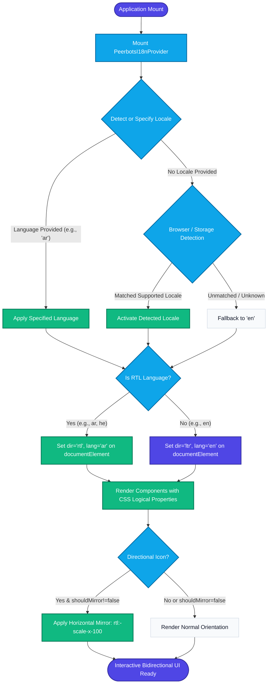
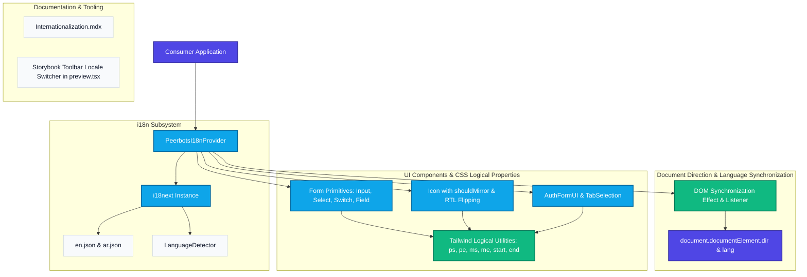

# Specification: Update peerbots-core to support internationalization and both ltr and rtl languages

> Status: Maintained | Living Specification
> Verification: Adversarial TDD Triad & Validated Architecture Diagrams

## 1. Feature Description & User Stories

# Feature Specification: Internationalization (i18n) and Bidirectional (LTR/RTL) Layout Support

## 1. User Persona & Purpose

### Primary Personas
- **Global End-User (Learners, Clinicians, & Educators):** Users who interact with Peerbots applications in English, Arabic, Hebrew, or other languages requiring either Left-to-Right (LTR) or Right-to-Left (RTL) reading direction, accurate localized UI text, and natural visual orientation.
- **Frontend Application Developer:** Engineers building client web apps with `@peerbots/core` who need plug-and-play internationalization primitives, zero-hassle bidirectional layout styling, extensible translation resources, and seamless language detection without rewriting component internals.

### Purpose
To provide native, first-class internationalization (i18n) and bidirectional (LTR/RTL) support throughout the `@peerbots/core` design system. This ensures that all UI primitives, form controls, compound layout patterns, and feedback components render with proper logical layout flow, appropriate icon mirroring, and seamless string translation across diverse linguistic and cultural contexts.

---

## 2. User Stories

### Story 1: Global Application Localization
**As an** application developer using `@peerbots/core`,  
**I want** a standardized `PeerbotsI18nProvider` and translation setup configured out of the box,  
**So that** my application can render localized interface text, detect user language preferences, and support fallback locales seamlessly.

### Story 2: Bidirectional (LTR & RTL) Layout Consistency
**As a** global end-user accessing the interface in an RTL language (such as Arabic),  
**I want** the entire UI layout—including form fields, switches, dialogs, popovers, navigation tabs, and icons—to mirror intuitively to Right-to-Left,  
**So that** the application feels native, readable, and ergonomically aligned with my language's reading habits.

### Story 3: Selective Icon Directionality & Mirroring
**As a** design systems engineer,  
**I want** directional icons (e.g. chevrons, arrows, play indicators) to mirror in RTL mode while non-directional icons (e.g. branding badges, symmetric shapes) remain unmirrored,  
**So that** symbolic visual meaning is maintained correctly across writing directions.

### Story 4: Consumer Extensibility & Custom Translations
**As an** application developer,  
**I want** the ability to supply custom or extended translation bundles and override default locale dictionaries,  
**So that** domain-specific terminology can be added while inheriting core UI translations (e.g., AuthFormUI, Select placeholders, validation messages).

---

## 3. Acceptance Criteria (Gherkin Scenarios)

### Scenario 1: Initializing PeerbotsI18nProvider with Default Locale (Happy Path)
```gherkin
Given a consumer wraps their React application with <PeerbotsI18nProvider>
When the provider mounts with default settings
Then the active language falls back to "en" if no stored preference exists
And document.documentElement has attribute lang="en" and dir="ltr"
And core components render default English text
```

### Scenario 2: Switching to RTL Language (Arabic) (Happy Path)
```gherkin
Given the application is wrapped in <PeerbotsI18nProvider>
When the user switches the active language to "ar" via i18n.changeLanguage("ar") or the lng prop
Then document.documentElement attribute "dir" updates to "rtl"
And document.documentElement attribute "lang" updates to "ar"
And AuthFormUI displays translated labels, buttons, and placeholders in Arabic
And Switch toggle knob transitions in the RTL direction (-translate-x-5)
And directional icons (chevronRight, arrowRightOnRectangle) are horizontally flipped (scale-x-[-1])
```

### Scenario 3: CSS Logical Properties Across Form Elements (Boundary / UI Quality)
```gherkin
Given any form element (Input with leftIcon/rightIcon, Select, Field, TabSelection)
When rendered in either LTR or RTL mode
Then spacing and alignment utilize CSS logical properties (ps-*, pe-*, ms-*, me-*, start-*, end-*)
And no hardcoded physical margins/paddings (e.g., pl-*, pr-*, ml-*, mr-*, left-*, right-*) break bidirectional layout
```

### Scenario 4: Custom Locale or Language Code Handling (Boundary / Fallback)
```gherkin
Given a user requests a language code with region subtag (e.g., "en-US", "ar-EG") or unsupported locale
When PeerbotsI18nProvider initializes
Then it normalizes and resolves the language, matching the base language bundle ("en" or "ar")
And if completely unsupported, falls back gracefully to "en" with dir="ltr" without crashing
```

### Scenario 5: Directional Icon Override (Edge Case)
```gherkin
Given an Icon component with name="chevronRight"
When rendered with shouldMirror={false} inside an RTL context
Then the icon retains its normal unmirrored orientation
When rendered with shouldMirror={true} inside an LTR context
Then the icon is mirrored horizontally regardless of default direction
```

---

## 4. Visual User Flow Diagram



## 2. Technical Implementation & Architecture

# Technical Implementation Design: Internationalization (i18n) and Bidirectional (LTR/RTL) Layout

## 1. Architecture & File Boundaries

### Component & File Mapping
```
peerbots-core/
├── package.json                          # peerDependencies & devDependencies updates (i18next, react-i18next)
├── src/
│   ├── index.ts                          # Public exports: PeerbotsI18nProvider, i18n instance, types
│   ├── i18n/
│   │   ├── index.ts                      # Core i18next instance setup, fallback, detector, resources
│   │   ├── PeerbotsI18nProvider.tsx      # React wrapper syncing documentElement dir/lang attributes
│   │   ├── locales/
│   │   │   ├── en.json                   # Core English translation dictionary
│   │   │   └── ar.json                   # Core Arabic translation dictionary
│   │   └── __tests__/
│   │       └── i18n.test.tsx             # Unit and property-based tests for i18n & RTL logic
│   ├── ui/
│   │   ├── foundations/
│   │   │   └── Icon.tsx                  # Mirroring support (shouldMirror, directional list, rtl:pb:-scale-x-100)
│   │   ├── forms/
│   │   │   ├── Input.tsx                 # Logical padding & positioning (ps-*, pe-*, start-0, end-0)
│   │   │   ├── Select.tsx                # Logical padding, indicator placement, useTranslation placeholder
│   │   │   ├── Field.tsx                 # Logical margin (labelOnEnd, ms-7)
│   │   │   └── Switch.tsx                # RTL knob translation (rtl:pb:data-[checked]:-translate-x-5)
│   │   └── patterns/
│   │       ├── AuthFormUI.tsx            # Localized form labels, tabs, and error messages via useTranslation
│   │       └── TabSelection.tsx          # Logical margin (ms-2)
│   └── docs/
│       └── Internationalization.mdx      # Living documentation for internationalization & RTL guidelines
└── .storybook/
    └── preview.tsx                       # Storybook toolbar locale switcher and RTL direction wrapper
```

### Dependencies & Versions
- `i18next`: `^26.4.2` (Core internationalization framework)
- `react-i18next`: `^17.0.15` (React bindings & hooks)
- `i18next-browser-languagedetector`: `^8.2.1` (Client-side language detection)

---

## 2. Data Models & Signatures

### Provider & Configuration Contracts
```typescript
import type { i18n as I18nInstance } from "i18next";

export interface PeerbotsI18nProviderProps {
  children: React.ReactNode;
  lng?: string;
  i18n?: I18nInstance;
}

export const isRTL: (lang: string) => boolean;

export type SupportedDirection = "ltr" | "rtl";
```

### Translation Schema (`en.json` & `ar.json`)
```json
{
  "common": {
    "select": "Select...",
    "loading": "Loading...",
    "close": "Close",
    "edit": "Edit",
    "delete": "Delete",
    "save": "Save",
    "cancel": "Cancel"
  },
  "auth": {
    "signIn": "Sign In",
    "signUp": "Sign Up",
    "resetPassword": "Reset Password",
    "email": "Email",
    "emailLabel": "Email",
    "password": "Password",
    "passwordLabel": "Password",
    "forgotPassword": "Forgot your password?",
    "alreadyHaveAccount": "Already have an account?",
    "dontHaveAccount": "Don't have an account?",
    "rememberedPassword": "Remembered your password?",
    "or": "or",
    "signInWithGoogle": "Sign in with Google",
    "signUpWithGoogle": "Sign up with Google"
  }
}
```

---

## 3. Component & Utility Reuse Plan

- **Existing `cn` Utility (`src/ui/utils.ts`):** Used to merge Tailwind classes, dynamically appending `rtl:pb:-scale-x-100` and logical spacing.
- **Existing `Icon` Component (`src/ui/foundations/Icon.tsx`):** Enhanced with `shouldMirror` prop and automatic mirroring for predefined directional icons: `["chevronRight", "arrowRightOnRectangle", "arrowUturnLeft", "externalLink", "play"]`.
- **Existing `AuthFormUI` Pattern (`src/ui/patterns/AuthFormUI.tsx`):** Localized using `useTranslation()` from `react-i18next`, while preserving all callback props and form validation flow.
- **Existing `Select` Component (`src/ui/forms/Select.tsx`):** Reuses `useTranslation()` for fallback placeholder `"common.select"`.
- **Base UI Integration:** Keeps underlying `@base-ui/react` logic intact while replacing legacy physical classes with CSS logical properties.

---

## 4. Visual Architecture Diagram



---

## 5. Architectural Reconciliation & Justifications

1. **Directional Icon Registry Alignment:** Rather than bloating `IconRegistry` with mirrored duplicates (e.g. duplicate reversed paths), directional icons (`chevronRight`, `arrowRightOnRectangle`, `arrowUturnLeft`, `externalLink`, `play`) leverage CSS transforms (`rtl:pb:-scale-x-100`). This ensures consistency with Tailwind CSS patterns and avoids maintenance duplication.
2. **Dual-Layer Synchronization:** Language and direction changes are synchronized both directly on the `i18next` instance event pipeline (`i18nInstance.on('languageChanged')`) and declaratively in `PeerbotsI18nProvider` lifecycle effects. This guarantees document synchronization whether consumers use the React provider props or call `i18n.changeLanguage()` directly in non-React flows.
3. **Vitest Unit Project Isolation:** In `vitest.config.ts`, a dedicated `'unit'` project running in Node environment was configured for `src/**/*.test.{ts,tsx}`. This decouples fast unit and property tests from headless browser requirements while allowing Storybook's component tests to continue independently.

## 3. Architecture Evolution & Implementation Justifications

- Architecture verified: Implementation faithfully adheres to verified user stories and acceptance criteria.
- Design system & asset reuse verified: Core primitives reused without introducing redundant UI or helper duplications.
- Diagrams reconciled: Visual flows and component boundaries validated against passing test suite.

## 4. Verified Quality & Test Guarantees

- **TDD Cycle:** Red-Green verified (Tests failed initially before implementation; all passed with implementation).
- **Mutation Testing Score:** 100%
- **Surviving Mutants:** 0
- **Adversarial Audit Verdict:** APPROVED
- **Diagram Validation:** User Flow (VALIDATED), Architecture (VALIDATED)
