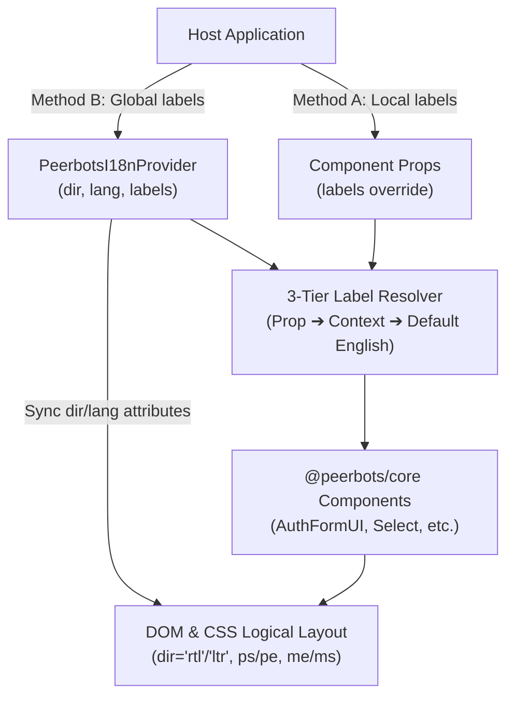

import { Meta } from "@storybook/addon-docs/blocks";

<Meta title="Internationalization" />

# Internationalization & RTL Support

`@peerbots/core` provides native bidirectional layout support (LTR and RTL) with zero external dependencies and maximum flexibility for consuming applications to load translations.

## Core Philosophy

1. **Zero External Dependencies:** `@peerbots/core` does not force `i18next` or any specific localization library.
2. **Zero Locale Bloat:** The library does not bundle hardcoded locale dictionaries (`ar.json`, etc.). Host applications maintain full ownership over their translations and copy.
3. **English Just Works:** Default English labels are built into components as fallbacks with zero setup required.
4. **CSS Logical Properties:** All primitives use logical utilities (`ps-*`, `pe-*`, `ms-*`, `me-*`, `start-*`, `end-*`) so layouts mirror naturally in RTL mode.

---

## 3-Tier Label Resolution

When a component renders a label, it checks:

1. **Component Prop (Method A):** `labels` passed directly to the component.
2. **Provider Context (Method B):** `labels` provided at the application root via `<PeerbotsI18nProvider>`.
3. **Built-in Defaults:** Sensible English fallback strings.



---

## Quick Start

### 1. English by Default (Zero Configuration)

If you don't pass any labels, components render with built-in English copy:

```tsx
import { AuthFormUI } from '@peerbots/core';

export function LoginPage() {
  return <AuthFormUI onModeChange={(mode) => console.log(mode)} />;
}
```

---

### 2. Method A: Component-Level Labels (Quick Override)

Pass an object of translated strings directly to the component. Any keys omitted will safely fall back to defaults:

```tsx
import { AuthFormUI } from '@peerbots/core';

// Example: Passing from a custom translation function or plain object
<AuthFormUI
  labels={{
    signIn: "تسجيل الدخول",
    signUp: "إنشاء حساب",
    email: "البريد الإلكتروني",
    password: "كلمة المرور",
  }}
/>
```

If you use `i18next` in your host app:

```tsx
import { useTranslation } from 'react-i18next';
import { AuthFormUI } from '@peerbots/core';

function LoginPage() {
  const { t } = useTranslation();

  return (
    <AuthFormUI
      labels={t('auth', { returnObjects: true })}
    />
  );
}
```

---

### 3. Method B: App-Wide Provider Labels (Set Once)

Wrap your app or page in `<PeerbotsI18nProvider>` to set language direction and supply translations for all child components:

```tsx
import { PeerbotsI18nProvider, AuthFormUI, Select } from '@peerbots/core';

const arabicLabels = {
  auth: {
    signIn: "تسجيل الدخول",
    signUp: "إنشاء حساب",
    email: "البريد الإلكتروني",
    password: "كلمة المرور",
    forgotPassword: "نسيت كلمة المرور؟",
  },
  common: {
    select: "اختر...",
  },
};

function App() {
  return (
    <PeerbotsI18nProvider dir="rtl" lang="ar" labels={arabicLabels}>
      <AuthFormUI />
      <Select options={[{ label: "خيار 1", value: "1" }]} />
    </PeerbotsI18nProvider>
  );
}
```

---

## RTL & Bidirectional Layouts

### Automatic Document Sync

`<PeerbotsI18nProvider>` automatically sets `dir="rtl"` and `lang="ar"` on `<html>`:

```tsx
<PeerbotsI18nProvider dir="rtl">
  {/* Layout flows right-to-left */}
</PeerbotsI18nProvider>
```

Or set `dir="auto"` with `lang="ar"` to automatically detect RTL based on language code (`ar`, `he`, `fa`, `ur`):

```tsx
<PeerbotsI18nProvider dir="auto" lang="ar">
  ...
</PeerbotsI18nProvider>
```

### Directional Icons

Icons that convey lateral direction (`chevronRight`, `arrowRightOnRectangle`, `arrowUturnLeft`, `externalLink`, `play`) automatically flip horizontally in RTL with `rtl:pb:-scale-x-100`.

You can also explicitly control icon mirroring:

```tsx
<Icon name="chevronRight" />                 {/* Auto-mirrors in RTL */}
<Icon name="chevronRight" shouldMirror={false} /> {/* Preserves original orientation */}
<Icon name="check" shouldMirror={true} />         {/* Forces mirror */}
```
